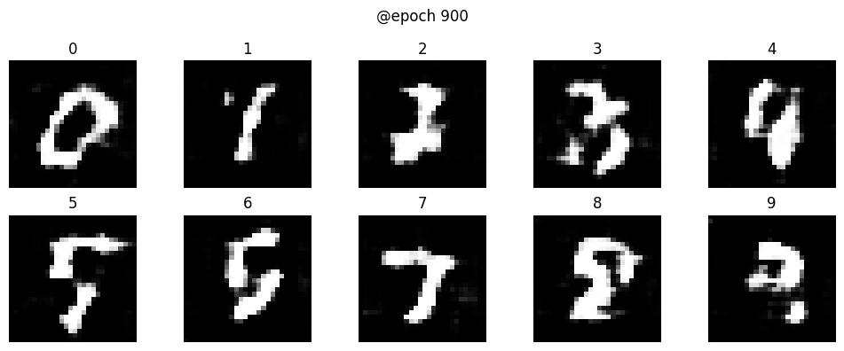

# AC-GAN on MNIST Dataset

An implementation of an Auxiliary Classifier Generative Adversarial Network (AC-GAN) to synthesize handwritten digits based on the MNIST dataset. 

Unlike a standard GAN that relies solely on random noise, this AC-GAN conditions the generator on class labels, allowing for the targeted generation of specific digits (0-9) while maintaining high image variance and quality.

## 🧠 Architecture Details

* **Generator:** Takes a concatenated input of a latent noise vector (dim=100) and a one-hot encoded class label. Utilizes `Dense`, `Reshape`, `UpSampling2D`, and `Conv2D` layers with Batch Normalization and ReLU activations, outputting a 28x28x1 image via a `tanh` activation.
* **Discriminator:** A Convolutional Neural Network utilizing `Conv2D` layers with stride 2 for downsampling, `LeakyReLU` activations (alpha=0.2), and `Dropout` (rate=0.3) to prevent mode collapse. It outputs two branches:
    * A `sigmoid` dense layer for real/fake validity.
    * A `softmax` dense layer (10 units) for class label prediction.

## 📐 Mathematical Foundation

The objective function consists of two parts: the log-likelihood of the correct source ($L_S$) and the log-likelihood of the correct class ($L_C$).

$$L_S = \mathbb{E}[\log P(S=real \mid X_{real})] + \mathbb{E}[\log P(S=fake \mid X_{fake})]$$

$$L_C = \mathbb{E}[\log P(C=c \mid X_{real})] + \mathbb{E}[\log P(C=c \mid X_{fake})]$$

* **The Discriminator** is trained to maximize $L_S + L_C$.
* **The Generator** is trained to maximize $L_C - L_S$.

*Optimizer:* Adam (lr=0.0002, beta_1=0.5)

## 🛠️ Tech Stack

* **Language:** Python
* **Framework:** TensorFlow / Keras
* **Libraries:** NumPy, Matplotlib

## 🚀 How to Run (Make sure you have python installed)

1. Clone the repository:
    ```bash
   git clone [https://github.com/TaufeequeUmer/ac-gan-mnist.git](https://github.com/TaufeequeUmer/ac-gan-mnist.git)
   ```

2. Install the requirements
     ```bash
    cd ac-gan-mnist
    pip install -r requirements.txt
    ```

3. Open the Jupyter Notebook and execute the cells sequentially to train the model and generate digits.
    ```bash
    jupyter notebook AC-GAN_notebook.ipynb
    ```

## 📊 Results

The following image shows the digits synthesized by the generator after 900 epochs of training:

